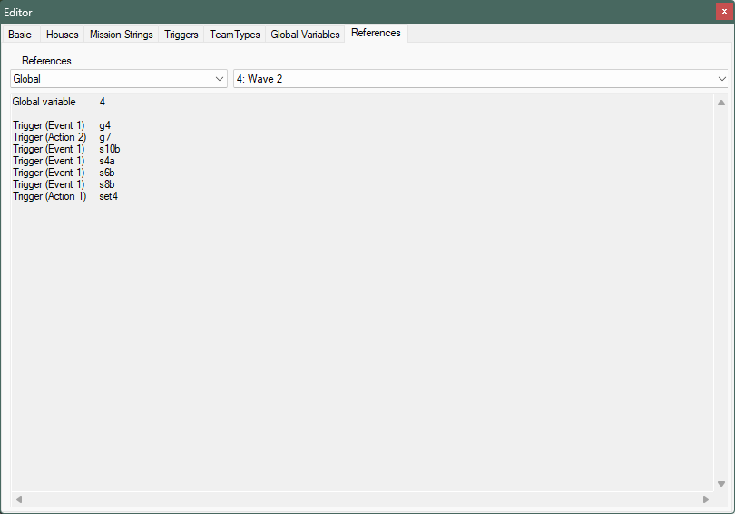

Red Alert Mission Editor

-------

 - [About the Project](#about-the-project)
 - [Requirements](#requirements)
 - [Features](#features) 
 - [Development](#development) 

-------

## About this Project

This is a mission and map editor made for the Red Alert (RA95) 3.03 "s" series, hosted here https://github.com/nguoiyoujie/ra303p-iran. This is intended to be used for modding setups that use features found in the Red Alert 3.03 "s" series as well as its preceding Iran's "p" series. 

## Requirements

A working copy of RA95 should exist in the machine. You need not unpack this project in the RA95 directory. However, in the beginning, a prompt will be made to seek the RA95 executable. This project uses assets from the directory to ensure a close match to the game experience. 

## Features

 - Reads mix files associated with RA95 game directory to extract image and rules data from them.

 - Supports new theaters such as "jungle", "cave", and "barren", if the game directory has these assets installed.
 

 
 - Supports theater modifications and extensions by exposing all template references that can be used by the game.
 

 - Preview of object placement by the user is periodically highlighted to identify it from other objects.

 - The currently selected Waypoint and CellTrigger is highlighted to identify them from other objects.

 - Allows the use of extended Techno types (units, infantry, aircraft, ships, buildings), made available since Red Alert "p" series by Iran. New technotypes will show names as referenced via stringtable offsets introduced in "s" series, or via Name= entries.

 - Customizing house colors, made available since Red Alert "p" series by Iran, will update the editor screen accordingly.
 

 
 - Allows the correct reading and setting of trigger actions added by Iran for the Red Alert "p", and by lovalmidas for the "s" series.
 

 - Allows the user to configure additional INI extensions added for the "p" and "s" series.
 

 - Hosts an table for editing Mission Text strings, a feature since the Red Alert "p" series.
 

 
 - Allows the user to input helper comments to Triggers, TeamTypes and Global Variables, which will not be used by the game, but as working aids for easier reference by the map designer.

 - Allows the user to duplicate Triggers and TeamTypes, reminicient of the Final Sun / Final Alert 2 map editors.
 

 - Allows the user to sort Triggers and TeamTypes by alphabetical order, as well as manual sorting.
 
 - Hosts an INI editor reminicient of the Final Sun / Final Alert 2 map editors.
 

 - Hosts a statistics page with summarized information about the houses. This includes a power/drain calculation which may be useful for base planning.
 

 - Hosts a view of reference trackers linking to certain Waypoints, Triggers, TeamTypes, Global Variables, or Mission Text strings.
 

 - Supports shift translation for the entire map.
 

 - Supports Select Mode, where the user can pick multiple cells for clear, copy and paste.
 

 - In Select Mode, user can save the selected cells as an extract file, for future copy and paste. This allows map parts to be copied over to other maps.
 

 - Supports rendering the map display as an image and save to disk.
 

 - Supports launching the game via the command line and load the specific mission as testmap.ini. Supported only by the "s" series executable. 
 

## Development

This project is created and maintained with Visual Studio 2019.

The project is built for Microsoft .NET Framework v4.0.

